# lit_DB: PDF Ebook Analysis Tool

A Python application that analyzes PDF ebooks using a local Ollama server to detect keywords and topics.

## Features

- 📖 PDF text extraction and analysis
- 🤖 Local LLM analysis via Ollama
- 🔑 Configurable keyword extraction (max number via config)
- 📊 Topic detection and classification
- 📁 Batch processing of PDF folders
- 💾 SQLite database with JSON backup
- 🛠️ Automatic model installation
- 🔍 **NEW:** Semantic similarity search using ChromaDB
- 📈 **NEW:** Document clustering and topic analysis
- 🧠 **NEW:** Vector embeddings for intelligent document discovery

## Architecture

```mermaid
graph TB
    %% User Interface Layer
    subgraph "🖥️ User Interface Layer"
        CLI["🚀 main.py<br/>📋 Click Commands<br/>🎨 Rich Formatting"]
    end
    
    %% Core Application Layer
    subgraph "⚙️ Core Application Layer"
        PA["📖 PDFAnalyzer<br/>🔍 Text Extraction<br/>🧠 Analysis Orchestration"]
        OC["🤖 OllamaClient<br/>🔗 LLM Communication<br/>📡 Model Management"] 
        CM["⚙️ ConfigManager<br/>📋 YAML Processing<br/>✅ Validation"]
        DM["🗄️ DatabaseManager<br/>💾 SQLite Operations<br/>🔄 Deduplication Logic"]
        Models["📊 models.py<br/>🛡️ Pydantic Validation<br/>📝 Data Schemas"]
    end
    
    %% External Systems Layer
    subgraph "🌐 External Systems"
        direction TB
        Ollama["🦙 Ollama Server<br/>🧠 Local LLM Engine<br/>🔥 mistral:7b / llama3.2"]
        PDFs["📚 PDF Collection<br/>📁 test_literature/<br/>📄 Document Library"]
        Config["⚙️ config.yaml<br/>🔧 Application Settings<br/>🎛️ Model Configuration"]
    end
    
    %% Data Persistence Layer
    subgraph "💾 Data Persistence Layer"
        direction LR
        DB[("🗃️ SQLite Database<br/>📋 files, analysis_results, topics<br/>🔍 Hash-based Deduplication<br/>📊 Metadata & Analytics")]
        JSON["📄 JSON Backup<br/>📁 results/<br/>💾 Legacy Format"]
        Logs["📝 Application Logs<br/>📁 logs/<br/>🔍 Debug & Monitoring"]
    end
    
    %% Data Flow Connections
    CLI ==>|"🎯 Commands"| PA
    CLI ==>|"⚙️ Config"| CM
    
    PA ==>|"🤖 Analysis Requests"| OC
    PA ==>|"💾 Store Results"| DM
    PA ==>|"✅ Validate Data"| Models
    PA ==>|"📖 Read Files"| PDFs
    PA ==>|"📄 Backup Save"| JSON
    PA ==>|"📝 Logging"| Logs
    
    CM ==>|"📋 Load Settings"| Config
    CM ==>|"✅ Validate Config"| Models
    
    DM ==>|"🔍 Query/Store"| DB
    DM ==>|"✅ Validate Schema"| Models
    
    OC ==>|"🔗 API Calls"| Ollama
    
    %% Enhanced Styling
    classDef cliStyle fill:#e3f2fd,stroke:#1976d2,stroke-width:3px,color:#0d47a1
    classDef coreStyle fill:#f3e5f5,stroke:#7b1fa2,stroke-width:2px,color:#4a148c
    classDef externalStyle fill:#fff3e0,stroke:#f57c00,stroke-width:2px,color:#e65100
    classDef storageStyle fill:#e8f5e8,stroke:#388e3c,stroke-width:2px,color:#1b5e20
    classDef databaseStyle fill:#fff9c4,stroke:#fbc02d,stroke-width:3px,color:#f57f17
    classDef ollamaStyle fill:#ffebee,stroke:#d32f2f,stroke-width:2px,color:#b71c1c
    
    class CLI cliStyle
    class PA,OC,CM,DM,Models coreStyle
    class Ollama ollamaStyle
    class PDFs,Config externalStyle
    class JSON,Logs storageStyle
    class DB databaseStyle
```



## Requirements

- Python 3.8+
- Ollama server running locally
- PDF files in the `test_literature/` folder

## Installation

1. **Clone and setup virtual environment:**
   ```bash
   cd lit_DB
   python3 -m venv venv
   source venv/bin/activate  # Linux/Mac
   # or
   venv\Scripts\activate     # Windows
   ```

2. **Install dependencies:**
   ```bash
   pip install -r requirements.txt
   ```
   
   *Note: The new semantic features require additional dependencies (ChromaDB, sentence-transformers, scikit-learn, numpy). These will be installed automatically with the requirements.txt.*

3. **Start Ollama server:**
   ```bash
   ollama serve
   ```

4. **Setup and install models:**
   ```bash
   python main.py setup
   ```

## Usage

### Analyze all PDFs in test_literature folder:
```bash
python main.py analyze
```

### Analyze a specific PDF:
```bash
python main.py analyze sample_book.pdf
```

### List available PDFs:
```bash
python main.py list-pdfs
```

### Check model status:  
```bash
python main.py check-model
```

### Install a specific model:
```bash
python main.py install-model llama3.2:3b
```

### Semantic Search Commands:

#### Search for documents by natural language query:
```bash
python main.py semantic-search "machine learning algorithms" --limit 5
```

#### Find documents similar to a specific PDF:
```bash
python main.py find-similar "sample_ml_book.pdf" --limit 3
```

#### Cluster documents by semantic similarity:
```bash
python main.py cluster-documents --num-clusters 5
```

#### View vector database statistics:
```bash
python main.py vector-stats
```

## Configuration

Edit `config.yaml` to customize:
- PDF folder location
- Maximum keywords per document
- Ollama server settings
- Output format and location

## Project Structure

```
lit_DB/
├── config.yaml          # Configuration file
├── main.py              # CLI interface
├── requirements.txt     # Python dependencies
├── src/                 # Source code
├── test_literature/     # PDF files for analysis
├── results/             # Analysis output
└── logs/               # Application logs
```

## Example Output

```json
{
  "filename": "sample_ml_book.pdf",
  "topic": "Machine Learning Basics",
  "keywords": [
    "machine learning",
    "artificial intelligence", 
    "neural networks",
    "deep learning",
    "data science",
    "computer vision",
    "algorithms"
  ],
  "confidence_score": 0.85,
  "page_count": 1,
  "word_count": 139,
  "timestamp": "2025-08-18 23:12:25"
}
```

## Quick Start

1. **Place PDF files** in the `test_literature/` folder
2. **Start Ollama**: `ollama serve` 
3. **Setup**: `python main.py setup`
4. **Analyze**: `python main.py analyze`

Results are saved as JSON files in the `results/` folder.