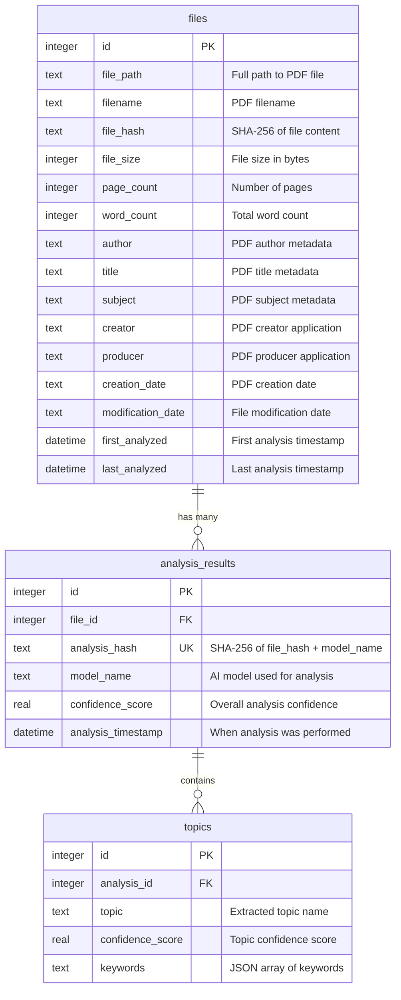

# Database Schema Documentation

## Overview

The lit_DB application uses SQLite to store PDF file metadata, analysis results, and extracted topics with keywords. The schema is designed for deduplication, efficient querying, and maintaining analysis history across different AI models.

## Entity Relationship Diagram



## Tables

### `files`
Stores PDF file metadata and processing history.

**Columns:**
- `id` (INTEGER, PRIMARY KEY) - Unique file identifier
- `file_path` (TEXT, NOT NULL) - Full filesystem path to PDF
- `filename` (TEXT, NOT NULL) - PDF filename only
- `file_hash` (TEXT, NOT NULL) - SHA-256 hash of file content
- `file_size` (INTEGER) - File size in bytes
- `page_count` (INTEGER) - Number of pages in PDF
- `word_count` (INTEGER) - Total word count from text extraction
- `author` (TEXT) - PDF author from metadata
- `title` (TEXT) - PDF title from metadata  
- `subject` (TEXT) - PDF subject from metadata
- `creator` (TEXT) - PDF creator application from metadata
- `producer` (TEXT) - PDF producer application from metadata
- `creation_date` (TEXT) - PDF creation date from metadata
- `modification_date` (TEXT) - File modification date
- `first_analyzed` (DATETIME) - Timestamp of first analysis
- `last_analyzed` (DATETIME) - Timestamp of most recent analysis

**Constraints:**
- `UNIQUE(file_path, file_hash)` - Prevents duplicate file entries

**Indexes:**
- `idx_files_hash` on `file_hash` - Fast hash lookups
- `idx_files_path` on `file_path` - Fast path lookups

### `analysis_results`
Links files to AI model analysis results.

**Columns:**
- `id` (INTEGER, PRIMARY KEY) - Unique analysis identifier
- `file_id` (INTEGER, FOREIGN KEY) - References `files(id)`
- `analysis_hash` (TEXT, UNIQUE, NOT NULL) - SHA-256 of `file_hash + model_name`
- `model_name` (TEXT, NOT NULL) - AI model used (e.g., "mistral:7b")
- `confidence_score` (REAL) - Overall analysis confidence (0.0-1.0)
- `analysis_timestamp` (DATETIME) - When analysis was performed

**Constraints:**
- `FOREIGN KEY (file_id) REFERENCES files (id)` - Maintains referential integrity
- `UNIQUE(analysis_hash)` - Prevents duplicate analyses for same file+model

**Indexes:**  
- `idx_analysis_hash` on `analysis_hash` - Fast deduplication lookups

### `topics`
Stores extracted topics and keywords for each analysis.

**Columns:**
- `id` (INTEGER, PRIMARY KEY) - Unique topic identifier
- `analysis_id` (INTEGER, FOREIGN KEY) - References `analysis_results(id)`
- `topic` (TEXT, NOT NULL) - Extracted topic name
- `confidence_score` (REAL) - Topic confidence score (0.0-1.0)
- `keywords` (TEXT) - JSON array of related keywords

**Constraints:**
- `FOREIGN KEY (analysis_id) REFERENCES analysis_results (id)` - Links to analysis

## Deduplication Strategy

The database prevents duplicate processing through a two-level hash system:

1. **File Hash** (`files.file_hash`) - SHA-256 of PDF file content
2. **Analysis Hash** (`analysis_results.analysis_hash`) - SHA-256 of `file_hash + model_name`

This ensures that:
- Same file with different models → separate analyses  
- Same file with same model → skipped (deduplicated)
- File content changes → new analysis even with same filename

## Query Patterns

### Check for Existing Analysis
```sql
SELECT 1 FROM analysis_results WHERE analysis_hash = ? LIMIT 1
```

### Get Analysis with Topics and File Info
```sql
SELECT ar.*, f.filename, f.file_path, f.page_count, f.word_count,
       f.author, f.title, f.subject, f.creation_date, f.modification_date
FROM analysis_results ar
JOIN files f ON ar.file_id = f.id  
WHERE ar.analysis_hash = ?
```

### Get Topics for Analysis
```sql
SELECT topic, confidence_score, keywords 
FROM topics 
WHERE analysis_id = ?
```

### Get Recent Analyses with File Metadata
```sql
SELECT f.filename, f.file_path, f.page_count, f.word_count, f.author, f.title,
       f.first_analyzed, f.last_analyzed,
       COUNT(ar.id) as analysis_count,
       GROUP_CONCAT(DISTINCT ar.model_name) as models_used
FROM files f
LEFT JOIN analysis_results ar ON f.id = ar.file_id
GROUP BY f.id
ORDER BY f.last_analyzed DESC
LIMIT ?
```

### Database Statistics
```sql
-- File count
SELECT COUNT(*) FROM files;

-- Analysis count  
SELECT COUNT(*) FROM analysis_results;

-- Topic count
SELECT COUNT(*) FROM topics;

-- Unique models used
SELECT DISTINCT model_name FROM analysis_results;
```

## Database Operations

The `DatabaseManager` class provides these key operations:

### Deduplication Methods
- `file_already_analyzed(analysis_hash)` - Check if analysis exists
- `get_existing_analysis(analysis_hash)` - Retrieve complete analysis result
- `_create_analysis_hash(file_hash, model_name)` - Generate analysis hash

### Storage Methods
- `save_analysis_result(result, metadata)` - Store new analysis with topics
- `_upsert_file(conn, result, metadata)` - Insert or update file record

### Query Methods
- `get_database_stats()` - Database statistics and metrics
- `get_analyzed_files(limit)` - List recently analyzed files with metadata

### Management Methods
- `reset_database()` - Drop and recreate all tables (destructive!)

## Configuration

Database settings in `config.yaml`:

```yaml
database:
  path: "./data/lit_db.sqlite"      # SQLite database file path
  enable_persistence: true          # Enable database storage
  backup_json: true                 # Also save JSON files as backup
```

## CLI Commands

Database-related CLI commands:

```bash
# Show database statistics
python main.py db-status

# List recently analyzed files (default: 20)
python main.py list-analyzed --limit 50

# Reset database (with confirmation prompt)
python main.py drop-db
```

## Data Flow

1. **PDF Analysis Request** → Check `analysis_hash` in database
2. **If exists** → Return cached result (deduplication)
3. **If new** → Process PDF → Extract metadata → Run LLM analysis
4. **Store Results** → Insert/update `files` → Insert `analysis_results` → Insert `topics`
5. **Optional JSON Backup** → Save to `results/` folder if `backup_json: true`

## Performance Considerations

### Indexes
- **Hash-based lookups** are O(1) via `idx_files_hash` and `idx_analysis_hash`
- **Path lookups** are optimized via `idx_files_path`
- **Foreign key relationships** maintain referential integrity

### Storage Efficiency
- **Normalized schema** eliminates data duplication
- **JSON keywords** stored as TEXT (SQLite doesn't have native JSON type)
- **File metadata** cached to avoid repeated PDF parsing

### Deduplication Benefits
- **Prevents reprocessing** of identical file+model combinations
- **Database checking** is faster than JSON file scanning
- **Supports multiple models** per file without duplication

## Database Schema Evolution

To add new columns or modify the schema:

1. **Update** `DatabaseManager._init_database()` SQL
2. **Add migration logic** if needed for existing databases
3. **Update** corresponding Pydantic models in `src/models.py`
4. **Test** with `python test_setup.py`

The schema uses `CREATE TABLE IF NOT EXISTS` for safe initialization on existing databases.