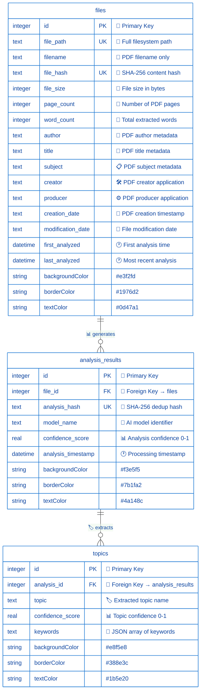
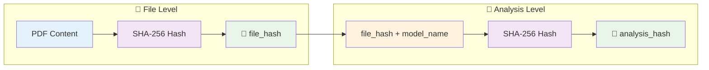
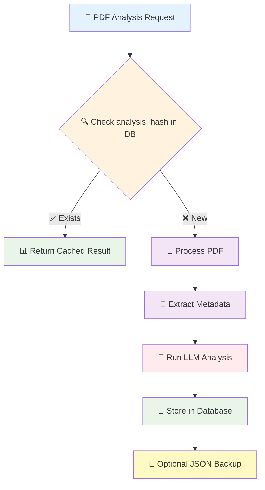

# 🗄️ Database Schema Documentation

## 📋 Overview

The **lit_DB** application uses SQLite to store PDF file metadata, analysis results, and extracted topics with keywords. The schema is designed for **hash-based deduplication**, **efficient querying**, and **maintaining analysis history** across different AI models.

### 🎯 **Key Features**
- **🔍 Deduplication**: Prevents reprocessing of identical file+model combinations
- **📊 Rich Metadata**: Comprehensive PDF metadata extraction and storage
- **🔗 Referential Integrity**: Proper foreign key relationships
- **⚡ Performance**: Optimized indexes for fast lookups
- **🧠 AI Model Tracking**: Support for multiple LLM models per document

---

## 🏗️ Entity Relationship Diagram



---

## 📊 Table Specifications

### 📁 **`files`** - PDF File Registry
> 🎯 **Purpose**: Central registry of all PDF files with comprehensive metadata and processing history

#### 📋 **Column Details**
| Column | Type | Constraints | Description |
|--------|------|-------------|-------------|
| 🔑 `id` | `INTEGER` | `PRIMARY KEY` | Unique file identifier |
| 📁 `file_path` | `TEXT` | `NOT NULL` | Full filesystem path to PDF |
| 📄 `filename` | `TEXT` | `NOT NULL` | PDF filename only |
| 🔐 `file_hash` | `TEXT` | `NOT NULL` | SHA-256 hash of file content |
| 📏 `file_size` | `INTEGER` | - | File size in bytes |
| 📃 `page_count` | `INTEGER` | - | Number of pages in PDF |
| 📝 `word_count` | `INTEGER` | - | Total word count from text extraction |
| 👤 `author` | `TEXT` | - | PDF author from metadata |
| 📖 `title` | `TEXT` | - | PDF title from metadata |
| 📋 `subject` | `TEXT` | - | PDF subject from metadata |
| 🛠️ `creator` | `TEXT` | - | PDF creator application |
| ⚙️ `producer` | `TEXT` | - | PDF producer application |
| 📅 `creation_date` | `TEXT` | - | PDF creation date from metadata |
| 📅 `modification_date` | `TEXT` | - | File modification date |
| 🕐 `first_analyzed` | `DATETIME` | `DEFAULT CURRENT_TIMESTAMP` | First analysis timestamp |
| 🕐 `last_analyzed` | `DATETIME` | `DEFAULT CURRENT_TIMESTAMP` | Most recent analysis timestamp |

#### 🔒 **Constraints & Indexes**
- 🚫 **Unique Constraint**: `UNIQUE(file_path, file_hash)` - Prevents duplicate entries
- ⚡ **Performance Indexes**:
  - `idx_files_hash` on `file_hash` - Lightning-fast hash lookups
  - `idx_files_path` on `file_path` - Quick path-based searches

---

### 🤖 **`analysis_results`** - AI Analysis Registry
> 🎯 **Purpose**: Links PDF files to AI model analysis results with deduplication

#### 📋 **Column Details**
| Column | Type | Constraints | Description |
|--------|------|-------------|-------------|
| 🔑 `id` | `INTEGER` | `PRIMARY KEY` | Unique analysis identifier |
| 🔗 `file_id` | `INTEGER` | `FOREIGN KEY` | References `files(id)` |
| 🔐 `analysis_hash` | `TEXT` | `UNIQUE, NOT NULL` | SHA-256 of `file_hash + model_name` |
| 🤖 `model_name` | `TEXT` | `NOT NULL` | AI model used (e.g., "mistral:7b") |
| 📊 `confidence_score` | `REAL` | `0.0-1.0` | Overall analysis confidence |
| 🕐 `analysis_timestamp` | `DATETIME` | `DEFAULT CURRENT_TIMESTAMP` | When analysis was performed |

#### 🔒 **Constraints & Indexes**
- 🔗 **Foreign Key**: `FOREIGN KEY (file_id) REFERENCES files (id)` - Referential integrity
- 🚫 **Unique Constraint**: `UNIQUE(analysis_hash)` - Prevents duplicate analyses
- ⚡ **Performance Index**: `idx_analysis_hash` - Ultra-fast deduplication lookups

---

### 🏷️ **`topics`** - Extracted Topics & Keywords
> 🎯 **Purpose**: Stores AI-extracted topics and keywords for each analysis

#### 📋 **Column Details**
| Column | Type | Constraints | Description |
|--------|------|-------------|-------------|
| 🔑 `id` | `INTEGER` | `PRIMARY KEY` | Unique topic identifier |
| 🔗 `analysis_id` | `INTEGER` | `FOREIGN KEY` | References `analysis_results(id)` |
| 🏷️ `topic` | `TEXT` | `NOT NULL` | Extracted topic name |
| 📊 `confidence_score` | `REAL` | `0.0-1.0` | Topic confidence score |
| 🔗 `keywords` | `TEXT` | `JSON` | JSON array of related keywords |

#### 🔒 **Constraints**
- 🔗 **Foreign Key**: `FOREIGN KEY (analysis_id) REFERENCES analysis_results (id)` - Links to analysis

---

## 🔄 Deduplication Strategy

### 🧠 **Smart Two-Level Hash System**

The database implements an intelligent deduplication mechanism using a **dual-hash architecture**:



### 🎯 **Deduplication Logic**

| Scenario | File Hash | Model | Result | Action |
|----------|-----------|-------|---------|---------|
| 📄 **Same file, same model** | ✅ Match | ✅ Match | 🚫 **SKIP** | Return cached result |
| 📄 **Same file, different model** | ✅ Match | ❌ Different | ✅ **ANALYZE** | New analysis entry |
| 📄 **Different file, same model** | ❌ Different | ✅ Match | ✅ **ANALYZE** | New file + analysis |
| 📄 **File content changed** | ❌ Different | ✅ Match | ✅ **ANALYZE** | New analysis (even same filename) |

### 🚀 **Performance Benefits**
- ⚡ **Instant Lookups**: O(1) hash-based deduplication checks
- 💾 **Storage Efficiency**: No redundant analysis data
- 🔄 **Model Flexibility**: Same file can be analyzed with multiple AI models
- 📊 **History Tracking**: Maintains complete analysis timeline

---

## 📝 Query Patterns & Examples

### 🔍 **Deduplication Check**
```sql
-- Fast existence check for analysis
SELECT 1 FROM analysis_results 
WHERE analysis_hash = ? 
LIMIT 1;
```

### 📊 **Complete Analysis Retrieval**
```sql
-- Get full analysis with file metadata and topics
SELECT 
    ar.id, ar.analysis_hash, ar.model_name, ar.confidence_score,
    f.filename, f.file_path, f.author, f.title, f.page_count,
    GROUP_CONCAT(t.topic) as topics,
    GROUP_CONCAT(t.keywords) as all_keywords
FROM analysis_results ar
JOIN files f ON ar.file_id = f.id
LEFT JOIN topics t ON ar.id = t.analysis_id
WHERE ar.analysis_hash = ?
GROUP BY ar.id;
```

### 🏷️ **Topic & Keywords Extraction**
```sql
-- Get all topics with keywords for an analysis
SELECT 
    topic,
    confidence_score,
    JSON_EXTRACT(keywords, '$') as keyword_array
FROM topics 
WHERE analysis_id = ?
ORDER BY confidence_score DESC;
```

### 📈 **Analytics & Reporting**
```sql
-- Recent analyses with comprehensive metadata
SELECT 
    f.filename,
    f.author,
    f.title,
    f.page_count,
    f.word_count,
    COUNT(DISTINCT ar.id) as analysis_count,
    GROUP_CONCAT(DISTINCT ar.model_name) as models_used,
    MAX(ar.analysis_timestamp) as last_analysis,
    COUNT(DISTINCT t.id) as total_topics
FROM files f
LEFT JOIN analysis_results ar ON f.id = ar.file_id
LEFT JOIN topics t ON ar.id = t.analysis_id
GROUP BY f.id
ORDER BY last_analysis DESC
LIMIT ?;
```

### 📊 **Database Statistics**
```sql
-- Comprehensive database metrics
SELECT 
    (SELECT COUNT(*) FROM files) as total_files,
    (SELECT COUNT(*) FROM analysis_results) as total_analyses,
    (SELECT COUNT(*) FROM topics) as total_topics,
    (SELECT COUNT(DISTINCT model_name) FROM analysis_results) as unique_models,
    (SELECT AVG(confidence_score) FROM analysis_results) as avg_confidence;
```

---

## 🛠️ Database Operations

### 🔧 **DatabaseManager Class Methods**

#### 🔍 **Deduplication Methods**
| Method | Purpose | Returns |
|--------|---------|---------|
| `file_already_analyzed(analysis_hash)` | ⚡ Ultra-fast existence check | `bool` |
| `get_existing_analysis(analysis_hash)` | 📊 Retrieve complete cached result | `AnalysisResult \| None` |
| `_create_analysis_hash(file_hash, model_name)` | 🔐 Generate deduplication hash | `str` |

#### 💾 **Storage Methods**
| Method | Purpose | Returns |
|--------|---------|---------|
| `save_analysis_result(result, metadata, file_hash)` | 💾 Store new analysis with topics | `int` (analysis_id) |
| `_upsert_file(conn, result, metadata, file_hash)` | 📁 Insert/update file record | `int` (file_id) |

#### 📊 **Query Methods**  
| Method | Purpose | Returns |
|--------|---------|---------|
| `get_database_stats()` | 📈 Database metrics & analytics | `Dict[str, Any]` |
| `get_analyzed_files(limit)` | 📋 Recent files with metadata | `List[Dict[str, Any]]` |

#### ⚠️ **Management Methods**
| Method | Purpose | ⚠️ Warning |
|--------|---------|------------|
| `reset_database()` | 🗑️ Drop and recreate all tables | **DESTRUCTIVE** - Deletes all data! |

---

## ⚙️ Configuration

### 📋 **Database Settings** (`config.yaml`)

```yaml
database:
  path: "./data/lit_db.sqlite"      # 📁 SQLite database file location
  enable_persistence: true          # 💾 Enable database storage (vs JSON-only)
  backup_json: true                 # 📄 Also save JSON files as backup
```

---

## 🖥️ CLI Commands

### 📊 **Database Management Commands**

| Command | Purpose | Options |
|---------|---------|---------|
| `python main.py db-status` | 📈 Show database statistics & metrics | - |
| `python main.py list-analyzed` | 📋 List recently analyzed files | `--limit N` (default: 20) |
| `python main.py drop-db` | 🗑️ Reset database (⚠️ destructive!) | Confirmation prompt |

### 💡 **Usage Examples**
```bash
# View database overview
python main.py db-status

# Show last 50 analyzed files with metadata
python main.py list-analyzed --limit 50

# Reset database (requires confirmation)
python main.py drop-db
```

---

## 🔄 Data Flow Architecture



---

## ⚡ Performance Optimizations

### 🚀 **Lightning-Fast Indexes**
| Index | Table | Purpose | Performance |
|-------|-------|---------|------------|
| `idx_files_hash` | `files` | Hash-based lookups | **O(1)** - Instant |
| `idx_analysis_hash` | `analysis_results` | Deduplication checks | **O(1)** - Instant |
| `idx_files_path` | `files` | Path-based searches | **O(log n)** - Very fast |

### 💾 **Storage Efficiency**
- 🗂️ **Normalized Schema**: Eliminates data duplication across tables
- 📝 **JSON Storage**: Keywords stored as TEXT (SQLite compatible)
- 🔄 **Metadata Caching**: Avoids repeated PDF parsing operations
- 📊 **Referential Integrity**: Foreign keys maintain data consistency

### 🎯 **Deduplication Benefits**
- ⚡ **Zero Reprocessing**: Identical file+model combinations skipped instantly
- 🚀 **Database Speed**: Hash lookups faster than JSON file scanning
- 🤖 **Multi-Model Support**: Same file analyzed with different AI models
- 📈 **Scalability**: Performance remains constant as database grows

---

## 🔧 Schema Evolution Guide

### 📋 **Adding New Features**

1. **🔄 Update Database Schema**
   ```python
   # In src/database_manager.py
   def _init_database(self):
       # Add your new columns here
   ```

2. **📊 Update Data Models**
   ```python  
   # In src/models.py
   class AnalysisResult(BaseModel):
       # Add new fields here
   ```

3. **🧪 Test Changes**
   ```bash
   python test_setup.py  # Verify database functionality
   ```

4. **📝 Update Documentation**
   - Update this `db_schema.md` file
   - Add migration notes if needed

### ⚠️ **Migration Safety**
- Uses `CREATE TABLE IF NOT EXISTS` for safe initialization
- Existing data preserved during updates
- Always backup database before schema changes
- Test migrations on development data first

---

> 📚 **Need Help?** Check the [DatabaseManager source code](src/database_manager.py) for implementation details or run `python main.py db-status` to verify your database setup.